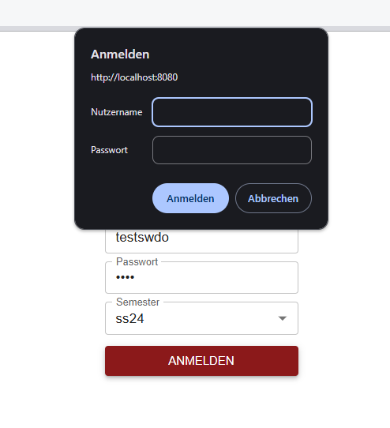
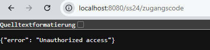

#### Termin Datenstruktur

```js
const wunschTermin = [{}];

const terminList = [{}];
```

### MUI DRAWER & DASHBOARD

- https://codesandbox.io/embed/ll9l3s?module=/src/Demo.js&fontsize=12
- https://codesandbox.io/embed/xmcfxl?module=/src/Demo.js&fontsize=12

### Change in Backend:

- Adding to prevent the pop-up login from API via browser.  
  

```java
.httpBasic()
.and()
.exceptionHandling()
.authenticationEntryPoint((request, response, authException) -> {
response.setContentType("application/json");
response.setStatus(HttpServletResponse.SC_UNAUTHORIZED);
response.getWriter().write("{\"error\": \"Unauthorized access\"}");
response.setHeader("WWW-Authenticate", ""); // Removes the browser login popup
})
```

After apply, access directly to API through browser will nomore work.  


### Time Hashmap - Idea for SW

1. Save time slot that being taken from other falkultat --> checkCollisionFromExternAppt
2. Check collision from intern
3. Save time slot that being scheduled for same dozent
4. Check for the conflict through hashmap

Obj = {
anfangszeit:
dauer:
gu:
sh:
}

```java
{
  0: [Obj, Obj],
  1: [ Obj, Obj ],
  2: [ Obj ]
}
```

### Problem

1. How to apply conflict check for raubus and other system that have other format from appt.

### TODO

1. Get method with termin from extern

```java
   public String postSemesternameSwAppt(String semestername, SwApptPost body, Collection<SimpleGrantedAuthority> grantedAuths) {
        if(!rechtFuerSwPlaner(grantedAuths)){
            throw new UnsuccessfulTransactionException("Benutzer habe keine Recht um neunen Termin zu buchen");
        }else{
            String wTerminId = body.getWunschterminId();
            if (wTerminId == null || wTerminId.isEmpty()) {
                throw new UnsuccessfulTransactionException("WunschterminID ist nicht eingegeben");
            }
            String whereStmt = "SEMESTERNAME = '" + semestername + "' AND ID = '" + wTerminId + "'";
            List<WunschterminSw> wtswListe = wunschterminSwDAO.selectAll(whereStmt);

            if (wtswListe == null || wtswListe.isEmpty()) {
                throw new UnsuccessfulTransactionException("Wunschtermin ist nicht gefunden");
            }

            if(body.getRaum() == null || body.getRaum().isEmpty()){
                throw new UnsuccessfulTransactionException("Raum ist nicht eingegben");
            }

//            int newStart = Integer.parseInt(terminService.calcTimeInMinutes(body.getAnfangszeit()));
//            int newDuration = Integer.parseInt(body.getDauer());
//            int newEnd = newStart + newDuration;
//            String newRhythmus = body.getRhythmus();
            String raumKonflikt = "Zeitkonflikt mit bestehendem Termin am gleichen Wochentag in Raum";
            String dozentKonflikt = "Zeitkonflikt: Dozent/-in hat einen anderen Termin im die Zeitinterval";

//            // Get Appt von andere Fak
//            List<Appointment> apptList = this.getAllAppointmentsforRoom(semestername, body.getRaum());
//            // Filter nach wochentag
//            List<Appointment> sameDayAppts = apptList.stream()
//                .filter(a -> a.getWochentag().equals(body.getWochentag()))
//                .collect(Collectors.toList());
//
//            // Loop durch sameDayAppts, um Kollision zwischen Zeitfenster prüfen
//            for (Appointment appt : sameDayAppts) {
//                int apptStart = Integer.parseInt(terminService.calcTimeInMinutes(appt.getAnfangszeit()));
//                int apptEnd = apptStart + Integer.parseInt(appt.getDauer());
//                String gu = appt.getGu();
//
//                if(newRhythmus.equals("W") || newRhythmus.equals("VZ2")){
//                    if (!(newEnd <= apptStart || newStart >= apptEnd)) {
//                        throw new UnsuccessfulTransactionException(raumKonflikt);
//                    }
//                }
//                if(newRhythmus.equals("VZ")){
//                    if (body.getStartDatum() == null || body.getStartDatum().isEmpty() || body.getStartDatum().equals("-")) {
//                        throw new UnsuccessfulTransactionException("Startdatum bei VZ-Termin fehlt");
//                    }
//                    boolean evenWeek = this.terminService.getWeekOfYear(LocalDate.parse(body.getStartDatum())) % 2 == 0; // check for even Week from startDatum
//                    if(gu.contains("G") && evenWeek){
//                        if (!(newEnd <= apptStart || newStart >= apptEnd)) {
//                            throw new UnsuccessfulTransactionException(raumKonflikt);
//                        }
//                    }
//                    if (gu.contains("U") && !evenWeek) {
//                        if (!(newEnd <= apptStart || newStart >= apptEnd)) {
//                            throw new UnsuccessfulTransactionException(raumKonflikt);
//                        }
//                    }
//                }
//                if(newRhythmus.equals("BK")){
//                    if (body.getStartDatum() == null || body.getStartDatum().isEmpty() || body.getStartDatum().equals("-")) {
//                        throw new UnsuccessfulTransactionException("Startdatum bei VZ-Termin fehlt");
//                    }
//                    boolean evenWeek = this.terminService.getWeekOfYear(LocalDate.parse(body.getStartDatum())) % 2 == 0;
//                    if (gu.contains("N")){
//                        if (!(newEnd <= apptStart || newStart >= apptEnd)) {
//                            throw new UnsuccessfulTransactionException(raumKonflikt);
//                        }
//                    }
//                    if(gu.contains("G") && evenWeek){
//                        if (!(newEnd <= apptStart || newStart >= apptEnd)) {
//                            throw new UnsuccessfulTransactionException(raumKonflikt);
//                        }
//                    }
//                    if (gu.contains("U") && !evenWeek) {
//                        if (!(newEnd <= apptStart || newStart >= apptEnd)) {
//                            throw new UnsuccessfulTransactionException(raumKonflikt);
//                        }
//                    }
//                }
//            }
//
//            // GetAllAppt von gleiche Dozent am Wochentag.
//            String benID = wtswListe.get(0).getBenuter_id();
//            whereStmt = "SEMESTERNAME = '" + semestername + "' AND BENUTZER_ID = '" + benID + "' AND WOCHENTAG = '" + body.getWochentag() + "'";
//            List<VeranstaltungSw> vsSwListe = veranstaltungSwDAO.selectAll(whereStmt);
//            for (VeranstaltungSw vs : vsSwListe){
//                int vsStart = Integer.parseInt(terminService.calcTimeInMinutes(vs.getAnfangszeit()));
//                int vsEnd = vsStart + Integer.parseInt(vs.getDauer());
//                String vsRhythmus = vs.getRhythmus();
//                //  Case W & VZ2
//                if(newRhythmus.equals("W") || newRhythmus.equals("VZ2")){
//                    if (!(newEnd <= vsStart || newStart >= vsEnd)) {
//                        throw new UnsuccessfulTransactionException(dozentKonflikt);
//                    }
//                }
//                // Case BK
//                if(newRhythmus.equals("BK")){
//                    if (body.getStartDatum() == null || body.getStartDatum().isEmpty() || body.getStartDatum().equals("-")) {
//                        throw new UnsuccessfulTransactionException("Startdatum bei BK-Termin fehlt");
//                    }
//
//                    if(vsRhythmus.equals("W")){
//                        if (!(newEnd <= vsStart || newStart >= vsEnd)) {
//                            throw new UnsuccessfulTransactionException(dozentKonflikt);
//                        }
//                    }
//                    if(vsRhythmus.equals("VZ")){
//                        boolean newEvenWeek = this.terminService.getWeekOfYear(LocalDate.parse(body.getStartDatum())) % 2 == 0;
//                        boolean existEvenWeek = this.terminService.getWeekOfYear( LocalDate.parse(vs.getStart_datum())) % 2 == 0;
//                        if(newEvenWeek == existEvenWeek){
//                            if (!(newEnd <= vsStart || newStart >= vsEnd)) {
//                                throw new UnsuccessfulTransactionException(dozentKonflikt);
//                            }
//                        }
//                    }
//                }
//                // Case VZ
//                if(newRhythmus.equals("VZ")){
//                    boolean newEvenWeek = this.terminService.getWeekOfYear(LocalDate.parse(body.getStartDatum())) % 2 == 0;
//                    boolean existEvenWeek = this.terminService.getWeekOfYear( LocalDate.parse(vs.getStart_datum())) % 2 == 0;
//                    if(newEvenWeek == existEvenWeek){
//                        if (!(newEnd <= vsStart || newStart >= vsEnd)) {
//                            throw new UnsuccessfulTransactionException(dozentKonflikt);
//                        }
//                    }
//                }
//            }

            if (checkSwApptRaumKonflikt(semestername, body)) {
                throw new UnsuccessfulTransactionException(raumKonflikt);
            }
            if (checkSwApptDozentKonflikt(semestername, body)) {
                throw new UnsuccessfulTransactionException(dozentKonflikt);
            }

            transaction.clearAllStatements();
            String wTerminQuery = "UPDATE SW_WUNSCHTERMINE SET "
                          + "STATUS=" + "'" + body.getStatus() + "'"
                          + "WHERE SEMESTERNAME=" + "'" + semestername + "' "
                          + "AND ID=" + "'" + wTerminId + "'";
            transaction.addStatement(wTerminQuery);

            String id = sucheMoeglicheID(veranstaltungSwDAO.selectAll("SEMESTERNAME = " + "'" + semestername + "'"));
            String apptQuery =  "INSERT INTO SW_VERANSTALTUNG VALUES ("
                + "'" + id + "',"
                + "'" + wTerminId + "',"
                + "'" + body.getTerminName() + "',"
                + "'" + body.getRaum() + "',"
                + "'" + body.getStatus() + "',"
                + "'" + body.getAnfangszeit() + "',"
                + "'" + body.getDauer() + "',"
                + "'" + body.getWochentag() + "',"
                + "'" + body.getRhythmus() + "',"
                + (body.getStartDatum() == null ? "NULL" : "'" + body.getStartDatum() + "'") + ","
                + "'" + body.getSemesterhaelfte()+ "',"
                + "'" + body.getBenutzerId() + "',"
                + "'" + semestername + "')";
            transaction.addStatement(apptQuery);

            boolean erfolg = transaction.startTransaction();
                if (!erfolg)
                {
                   throw new UnsuccessfulTransactionException("Fehler bei Transaction!");
                }
      }
      return "true";
    }

```

```js
/* eslint-disable no-unused-vars */
import { useState, useEffect } from "react";
import { Box, Button } from "@mui/material";
import { GridToolbar, DataGrid, GridActionsCellItem, gridClasses, GridToolbarContainer } from "@mui/x-data-grid";

import { deDE } from "@mui/x-data-grid/locales";
import { redAccent } from "../../theme";
// import MUIDialog from "../shared/MUIDialog";
// import TerminChangeForm from "./TerminChangeForm";
import * as apiService from "../../services/apiService";
// import ConfirmDialog from "./shared/ConfirmDialog";
import { numberToWeekday, formatTimeRange, dauerBerechnung } from "../../services/timeUtils";
import dayjs from "dayjs";
import { grey } from "@mui/material/colors";
import { EventAvailable, EventBusy } from "@mui/icons-material";
import { Fullscreen } from "@mui/icons-material";
// import MUIAccordion from "../../shared/MUIAccordion";

const CustomToolbar = ({ hideFullScreenButton = false, onFullScreenClick }) => {
  const handleOpenFullView = () => {
    if (onFullScreenClick) onFullScreenClick();
    window.open("/wunschtermine", "_blank");
  };

  return (
    <GridToolbarContainer>
      <GridToolbar csvOptions={{ delimiter: ";" }} printOptions={{ disableToolbarButton: true }} />
      {!hideFullScreenButton && (
        <Button color="primary" onClick={handleOpenFullView} size="small">
          <Fullscreen /> Vollbild in neuem Tab öffnen
        </Button>
      )}
    </GridToolbarContainer>
  );
};

const WunschTermine = ({
  height = "100%",
  hideFullScreenButton = false,
  // handleAddApptAppt,
  onFullScreenClick,
  // handleCancleAppt,
  rowData,
}) => {
  const [rows, setRows] = useState(rowData);
  const [openForm, setOpenForm] = useState(false);
  const [terminToEdit, setTerminToEdit] = useState({});

  // Broadcast channel to sync update for multi-Window.
  // So that each change from full screen table will be updated automatically in main window table
  const channel = new BroadcastChannel("wunschtermineChannel");
  useEffect(() => {
    getWunschtermine();
    const handleChannelMessage = (message) => {
      if (message.data === "update") {
        // console.log("Update detected via BroadcastChannel!");
        getWunschtermine();
      }
    };
    // Attach event listener to the channel
    channel.addEventListener("message", handleChannelMessage);
    return () => {
      // Remove event listener when component unmounts
      channel.removeEventListener("message", handleChannelMessage);
    };
    // eslint-disable-next-line react-hooks/exhaustive-deps
  }, []);

  useEffect(() => {
    setRows(rowData);
  }, [rowData]);

  const handleEditClick = (e) => () => {
    if (!e?.row?.rawData) return "";

    const rawData = e.row.rawData;

    // Replace null values with empty strings
    const sanitizedData = Object.fromEntries(
      Object.entries(rawData).map(([key, value]) => [key, value === null ? "" : value])
    );
    sanitizedData.vformat = sanitizedData.vformat ? sanitizedData.vformat.split(",") : [];
    sanitizedData.status = "geaendert";
    setTerminToEdit(sanitizedData);
    setOpenForm(true);
  };

  const handleAddApptAppt = async (e) => {
    const benId = JSON.parse(sessionStorage.getItem("user")).benutzer_id;
    const res = await apiService.putWunschTermin(
      sessionStorage.getItem("currentSemester"),
      { ...e, vformat: e.vformat.toString(), dauer: dauerBerechnung(e.anfangszeit, e.bis) },
      benId
    );
    if (res.status === 200) {
      setOpenForm(false);
      getWunschtermine(benId);
    } else {
      console.log(res);
    }
  };

  const getWunschtermine = async () => {
    try {
      const res = await apiService.getAllWunschtermine(sessionStorage.getItem("currentSemester"));
      if (Array.isArray(res.data)) {
        const terminList = res.data.map((el) => ({
          id: el.id,
          dozent: el.dozent,
          module: `${el.modul_id} ${el.modul_titel}`,
          lv_titel: el.lv_titel ? el.lv_titel : el.lv_frei_titel,
          block_titel: el.block_titel,
          rhythmus: el.rhythmus,
          vformat: el.vformat,
          lv_termin: el.wochentag
            ? `${numberToWeekday(el.wochentag)},  ${formatTimeRange(el.anfangszeit, el.dauer)}`
            : ` ${dayjs(el.start_datum).format("DD.MM.YYYY")},  ${formatTimeRange(el.anfangszeit, el.dauer)}`,
          start_datum: el.wochentag ? el.start_datum : "",
          raum_wunsch: el.raum_wunsch,
          co_dozent: el.co_dozent,
          max_tn: el.max_tn,
          warteliste_len: el.warteliste_len,
          status: el.status,
          rawData: { ...el },
        }));
        setRows(terminList);
      }
    } catch (e) {
      console.log(e);
    }
  };

  const handleCancelClick = (e) => async () => {
    if (window.confirm("Sind Sie sicher, diese Buchung zu stornieren?")) {
      const temp = { ...e.row.rawData, status: "storniert" };
      Object.keys(temp).forEach((key) => {
        if (temp[key] === null) {
          temp[key] = "";
        }
      });

      const benutzerId = e.row.rawData.benutzer_id;
      if (benutzerId) {
        const res = await apiService.putWunschTermin(sessionStorage.getItem("currentSemester"), temp, benutzerId);
        if (res.status === 200) {
          getWunschtermine();
          channel.postMessage("update");
        } else {
          console.log(res);
        }
      }
    }
  };

  const columns = [
    { field: "id", headerName: "ID", editable: false, type: "string", flex: 0.25 },
    { field: "dozent", headerName: "Dozent", editable: false, type: "string", flex: 0.675 },
    { field: "module", headerName: "Modul", editable: false, type: "string", flex: 1.25 },
    { field: "lv_titel", headerName: "LV-Titel", editable: false, type: "string", flex: 1 },
    { field: "block_titel", headerName: "BK-Titel (Opt.)", type: "string", flex: 0.75 },
    { field: "rhythmus", headerName: "Rhythmus", editable: false, type: "string", flex: 0.5 },
    { field: "lv_termin", headerName: "LV-Termin", editable: false, type: "string", flex: 1 },
    { field: "start_datum", headerName: "1. Tag", type: "string", flex: 0.5 },
    { field: "raum_wunsch", headerName: "Raumwunsch", type: "string", flex: 0.5 },
    { field: "co_dozent", headerName: "Co-Dozent", type: "string", flex: 0.5 },
    { field: "max_tn", headerName: "max. TN-Zahl", type: "number", flex: 0.5 },
    { field: "warteliste_len", headerName: "Wartelist", type: "string", flex: 0.5 },
    { field: "anmerkungen", headerName: "Anmerkung", type: "string", flex: 0.5 },
    { field: "vformat", headerName: "Virtuelles Format", type: "string", flex: 0.5 },
    { field: "status", headerName: "Status", editable: false, type: "string", flex: 0.5 },
    {
      field: "actions",
      type: "actions",
      headerName: "Aktion",
      flex: 0.75,
      cellClassName: "actions",
      getActions: (e) => {
        return [
          <GridActionsCellItem
            key="edit"
            icon={<EventAvailable />}
            label="Edit"
            className="textPrimary"
            onClick={handleEditClick(e)}
            color="primary"
            disabled={e.row.rawData.status === "storniert" ? true : false}
          />,
          <GridActionsCellItem
            key="edit"
            icon={<EventBusy />}
            label="Edit"
            className="textPrimary"
            onClick={handleCancelClick(e)}
            color="primary"
            disabled={e.row.rawData.status === "storniert" ? true : false}
          />,
        ];
      },
    },
  ];

  return (
    <Box>
      <Box
        height={height}
        sx={{
          "& .MuiDataGrid-root": {
            border: "none",
          },
          "& .MuiDataGrid-columnHeader": {
            backgroundColor: grey[300],
            color: redAccent[500],
          },
          "& .MuiDataGrid-columnHeaderTitle": {
            fontWeight: "700",
            fontSize: 13,
          },
          [`.${gridClasses.cell}.geplant`]: {
            backgroundColor: "#b9d5ff91",
          },
          [`.${gridClasses.cell}.storniert`]: {
            backgroundColor: "#f6685e75",
          },
          [`.${gridClasses.cell}.angefragt`]: {
            backgroundColor: "#6fbf7391",
          },
          [`.${gridClasses.cell}.geaendert`]: {
            backgroundColor: "#ffd32c75",
          },
          "& .MuiDataGrid-cell[data-field='id']": {
            fontWeight: "bold",
            color: redAccent[500],
          },
        }}
      >
        <DataGrid
          localeText={deDE.components.MuiDataGrid.defaultProps.localeText}
          initialState={{
            columns: {
              columnVisibilityModel: {
                raum_wunsch: false,
                co_dozent: false,
                max_tn: false,
                warteliste_len: false,
                anmerkungen: false,
                vformat: false,
                start_datum: false,
              },
            },
            density: "compact",
          }}
          sx={{ fontSize: 13 }}
          rows={rows}
          columns={columns}
          slots={{ toolbar: CustomToolbar }}
          slotProps={{
            toolbar: {
              hideFullScreenButton: hideFullScreenButton,
              onFullScreenClick: onFullScreenClick,
            },
          }}
          getCellClassName={(params) => {
            if (params.field === "status") {
              switch (params.value) {
                case "geplant":
                  return "geplant";
                case "angefragt":
                  return "angefragt";
                case "storniert":
                  return "storniert";
                case "geaendert":
                  return "geaendert";
                default:
                  return "";
              }
            }
          }}
        />
      </Box>

      {/* <MUIDialog
          onOpen={openForm}
          onClose={() => setOpenForm(false)}
          content={<BuchTerminForm initialValues={terminToEdit} onSubmit={handleAddAppt} />}
          disableBackdropClick="true"
          title={"Gebuchten Termin ändern"}
        /> */}
    </Box>
  );
};

export default WunschTermine;
```

```js
/* eslint-disable no-unused-vars */
import { useEffect } from "react";
import { Box, Button } from "@mui/material";
import { GridToolbar, DataGrid, GridActionsCellItem, gridClasses, GridToolbarContainer } from "@mui/x-data-grid";
import { deDE } from "@mui/x-data-grid/locales";
import { redAccent } from "../../theme";
import { grey } from "@mui/material/colors";
import { EventAvailable, EventBusy, Fullscreen } from "@mui/icons-material";
import { numberToWeekday, formatTimeRange } from "../../services/timeUtils";
import dayjs from "dayjs";

const CustomToolbar = ({ hideFullScreenButton = false, onFullScreenClick }) => {
  const handleOpenFullView = () => {
    if (onFullScreenClick) onFullScreenClick();
    window.open("/wunschtermine", "_blank");
  };

  return (
    <GridToolbarContainer>
      <GridToolbar csvOptions={{ delimiter: ";" }} printOptions={{ disableToolbarButton: true }} />
      {!hideFullScreenButton && (
        <Button color="primary" onClick={handleOpenFullView} size="small">
          <Fullscreen /> Vollbild in neuem Tab öffnen
        </Button>
      )}
    </GridToolbarContainer>
  );
};

const WunschTermine = ({
  height = "100%",
  hideFullScreenButton = false,
  onFullScreenClick,
  rowData = [],
  onCancelClick,
  onEditClick,
}) => {
  // Broadcast channel to listen for updates from other tabs
  useEffect(() => {
    const channel = new BroadcastChannel("wunschtermineChannel");

    const handleChannelMessage = (message) => {
      if (message.data === "update") {
        window.location.reload(); // or notify parent to refresh data
      }
    };

    channel.addEventListener("message", handleChannelMessage);

    return () => {
      channel.removeEventListener("message", handleChannelMessage);
      channel.close();
    };
  }, []);

  const handleCancelClick = (rowData) => async () => {
    await onCancelClick(rowData);

    // Broadcast update to other windows
    const channel = new BroadcastChannel("wunschtermineChannel");
    channel.postMessage("update");
    channel.close();
  };

  const handleEditClick = (rowData) => () => {
    onEditClick?.(rowData);
  };

  const columns = [
    { field: "id", headerName: "ID", flex: 0.25 },
    { field: "dozent", headerName: "Dozent", flex: 0.675 },
    { field: "module", headerName: "Modul", flex: 1.25 },
    { field: "lv_titel", headerName: "LV-Titel", flex: 1 },
    { field: "block_titel", headerName: "BK-Titel (Opt.)", flex: 0.75 },
    { field: "rhythmus", headerName: "Rhythmus", flex: 0.5 },
    { field: "lv_termin", headerName: "LV-Termin", flex: 1 },
    { field: "start_datum", headerName: "1. Tag", flex: 0.5 },
    { field: "raum_wunsch", headerName: "Raumwunsch", flex: 0.5 },
    { field: "co_dozent", headerName: "Co-Dozent", flex: 0.5 },
    { field: "max_tn", headerName: "max. TN-Zahl", flex: 0.5 },
    { field: "warteliste_len", headerName: "Wartelist", flex: 0.5 },
    { field: "anmerkungen", headerName: "Anmerkung", flex: 0.5 },
    { field: "vformat", headerName: "Virtuelles Format", flex: 0.5 },
    { field: "status", headerName: "Status", flex: 0.5 },
    {
      field: "actions",
      type: "actions",
      headerName: "Aktion",
      flex: 0.75,
      getActions: (e) => [
        <GridActionsCellItem
          key="edit"
          icon={<EventAvailable />}
          label="Edit"
          onClick={handleEditClick(e.row.rawData)}
          disabled={e.row.rawData.status === "storniert"}
        />,
        <GridActionsCellItem
          key="cancel"
          icon={<EventBusy />}
          label="Stornieren"
          onClick={handleCancelClick(e.row.rawData)}
          disabled={e.row.rawData.status === "storniert"}
        />,
      ],
    },
  ];

  return (
    <Box>
      <Box
        height={height}
        sx={{
          "& .MuiDataGrid-root": {
            border: "none",
          },
          "& .MuiDataGrid-columnHeader": {
            backgroundColor: grey[300],
            color: redAccent[500],
          },
          "& .MuiDataGrid-columnHeaderTitle": {
            fontWeight: "700",
            fontSize: 13,
          },
          [`.${gridClasses.cell}.geplant`]: {
            backgroundColor: "#b9d5ff91",
          },
          [`.${gridClasses.cell}.storniert`]: {
            backgroundColor: "#f6685e75",
          },
          [`.${gridClasses.cell}.angefragt`]: {
            backgroundColor: "#6fbf7391",
          },
          [`.${gridClasses.cell}.geaendert`]: {
            backgroundColor: "#ffd32c75",
          },
          "& .MuiDataGrid-cell[data-field='id']": {
            fontWeight: "bold",
            color: redAccent[500],
          },
        }}
      >
        <DataGrid
          localeText={deDE.components.MuiDataGrid.defaultProps.localeText}
          rows={rowData}
          columns={columns}
          slots={{ toolbar: CustomToolbar }}
          slotProps={{
            toolbar: {
              hideFullScreenButton,
              onFullScreenClick,
            },
          }}
          getCellClassName={(params) => {
            if (params.field === "status") return params.value;
            return "";
          }}
          sx={{ fontSize: 13 }}
        />
      </Box>
    </Box>
  );
};

export default WunschTermine;
```

Wunschtermine.jsx
...
const handleEditClick = (e) => () => {
if (!e?.row?.rawData) return "";

    const rawData = e.row.rawData;

    // Replace null values with empty strings
    const sanitizedData = Object.fromEntries(
      Object.entries(rawData).map(([key, value]) => [key, value === null ? "" : value])
    );
    sanitizedData.vformat = sanitizedData.vformat ? sanitizedData.vformat.split(",") : [];
    setWTermintoBook(sanitizedData);
    const temp = sanitizedData.map(wt => {return {
    id: wt.id,
    termin_name: ${wt.modul_id} ${wt.lv_titel},
    wunschtermin_id: wt.id,
    raum: "", // SELECT FIELD WITH roomList
    anfangszeit: wt.anfangszeit,
    dauer: wt.dauer,
    status: "geplant",
    wochentag: wt.wochentag, // SELECT FIELD
    rhythmus: wt.rhythmus,
    start_datum: wt.start_datum,
    semesterhaelfte: "0",
    benutzer_id: wt.benutzer_id

}})
setWTerminToBook(temp);
setOpenForm(true);
};

import { Box, Button, TextField, useMediaQuery } from "@mui/material";
import { Formik } from "formik";
import \* as yup from "yup";
import { FormDatePicker, FormInput, FormSelect } from "../formComponents";
import { LV_RHYTHMUS, TIME_PICKER_BIS, TIME_PICKER_VON, VIRTUELLES_FORMAT, WEEKDAY } from "../../constants";
import { formatDauerZuEndzeit } from "../../services/timeUtils";

const BuchTerminForm = ({ onSubmit, initialValues = initVal }) => {
const isNonMobile = useMediaQuery("(min-width:600px)");

return (
<Box m={"10px"}>
<Formik onSubmit={onSubmit} initialValues={initialValues} validationSchema={checkoutSchema}>
{({ handleSubmit, handleReset, handleChange }) => (

<form onSubmit={handleSubmit} onReset={handleReset}>
<Box
display={"grid"}
gap={"15px"}
gridTemplateColumns={"repeat(2, minmax(0,1fr))"}
sx={{ "& > div": { gridColumn: isNonMobile ? undefined : "span 2" } }} >
<TextField
defaultValue={`${initialValues.modul_id} ${initialValues.modul_titel}`}
label="Modul"
disabled
size="small"
/>
<FormInput name={"termin_name"} label="Terminname" disabled />

              <FormSelect
                name="anfangszeit"
                label="Von"
                options={TIME_PICKER_VON}
                defaultValue={initialValues.anfangszeit}
              />
              <FormSelect
                name="bis"
                label="Bis"
                options={TIME_PICKER_BIS}
                defaultValue={formatDauerZuEndzeit(initialValues.anfangszeit, initialValues.dauer)}
              />
              <FormSelect label="Wochentag" name="wochentag" options={WEEKDAY} defaultValue={initialValues.wochentag} />
              {initialValues.rhythmus === "BK" ? (
                <FormDatePicker name="start_datum" label="Datum" />
              ) : (
                <FormDatePicker name="start_datum" label="1.Tag (Opt.)" />
              )}
              <FormSelect
                span="2"
                name="rhythmus"
                label="LV-Rhythmus"
                defaultValue={initialValues.rhythmus}
                options={LV_RHYTHMUS}
                onChange={handleChange}
              />
              <FormSelect
                name={"vformat"}
                label="Virtuelles Format"
                options={VIRTUELLES_FORMAT}
                onChange={handleChange}
                multiple={true}
                defaultValue={initialValues.vformat}
                helperText={"Mehrfach wählbar"}
              />
              <Button type="submit" color="primary" variant="contained">
                Änderung speichern
              </Button>
            </Box>
          </form>
        )}
      </Formik>
    </Box>

);
};

export default BuchTerminForm;

const initVal = {
id: "0",
termin_name: "",
wunschtermin_id: "",
raum: "",
anfangszeit: "08:00",
dauer: "",
status: "",
wochentag: "0",
rhythmus: "W",
start_datum: "",
semesterhaelfte: "0",
benutzer_id: "",
vformat: "Präsenz" // UPDATE DIRECTLY IN SW_WUNSCHTERMIN
};

const checkoutSchema = yup.object().shape({});

Tabelle Wunschtermine:
--> Zeiten, Dauer, Wochentag, usw beihalten
--> Vformat aktuallisieren zusammen mit Status
--> Einfache geplanteTermine Tabelle --> Nur Delete Action möglich. (SameTable as BenutzerTable)
Zusatz: SwitchView --> View As Table --> ButtonGroup with Icon (Table and Schedule)
import InsertInvitationOutlinedIcon from '@mui/icons-material/InsertInvitationOutlined';
import TableChartOutlinedIcon from '@mui/icons-material/TableChartOutlined';

JAVA PUT METHOD: 1. Body = Object 2. Find Termin by ID --> Valid continue 3. checkConflict Extern 4. checkConflict Intern 5. UPDATE Query

### Old Schedule:

```js
import { useCallback, useMemo, useRef, useState } from "react";
import { VIEW_OPTIONS } from "../../constants";
import ApptEvent from "./ApptEvent";
import dayjs from "dayjs";
import { Views } from "react-big-calendar";
import { Box, Button, ButtonGroup, Typography, useMediaQuery } from "@mui/material";
import { DatePicker } from "@mui/x-date-pickers";
import { redAccent } from "../../theme";
import "./calendar.css";
import { ArrowBack, ArrowForward } from "@mui/icons-material";
import CustomWeekView from "./CustomWeekView";
import BlockoutEvent from "./BlockoutEvent";
import { Calendar as BigCalendar, dayjsLocalizer } from "react-big-calendar";
import "dayjs/locale/de";
import withDragAndDrop from "react-big-calendar/lib/addons/dragAndDrop";
import "react-big-calendar/lib/addons/dragAndDrop/styles.css";
import "react-big-calendar/lib/css/react-big-calendar.css";
// import * as apiService from "../../services/apiService";
import { getFirstMonday } from "../../services/timeUtils";
import ExtApptEvent from "./ExtApptEvent";

dayjs.locale("de");

const DnDCalendar = withDragAndDrop(BigCalendar);
const localizer = dayjsLocalizer(dayjs);

export default function Schedule({ height, events = [], resources = [], handleOnSelectEvent, handleOnSlotSelect }) {
  // const [semesterStart, setSemesterStart] = useState(getFirstMonday(sessionStorage.getItem("semesterStart")));
  const semesterStart = useRef(getFirstMonday(sessionStorage.getItem("semesterStart")));
  const [date, setDate] = useState(dayjs(semesterStart.current));
  const [view, setView] = useState(Views.WEEK);
  const [groupResourcesOnWeek, setGroupResourcesOnWeek] = useState(true);
  const showDatePicker = useMediaQuery("(min-width:1080px)");
  // const [contextMenuInfo, setContextMenuInfo] = useState();

  // const [semesterStart, setSemesterStart] = useState(getFirstMonday(sessionStorage.getItem("semesterStart")));
  // const [semesterEnde, setSemesterEnde] = useState(sessionStorage.getItem("semesterEnde"));
  // const [exdates, setExdates] = useState([]);
  // const [feiertage, setFeiertage] = useState([]);

  // const [resources, setResources] = useState([]);
  // const [roomsList, setRoomsList] = useState([]);
  // const [events, setEvents] = useState([]);

  // const [anchorEl, setAnchorEl] = useState(null);
  // const [selectedEvent, setSelectedEvent] = useState({});
  // const [popoverColor, setPopoverColor] = useState("");

  // const endeSH1 = useRef(null);

  // useEffect(() => {
  //   const getRoomsList = async () => {
  //     try {
  //       const res = await apiService.getRoomsList(sessionStorage.getItem("currentSemester"), "sw");
  //       const roomsList = res.data.map((el) => el.name);
  //       const temp = res.data.map((el) => {
  //         return {
  //           id: el.name,
  //           title: `${el.name} (${el.platzzahl})`,
  //         };
  //       });
  //       setRoomsList(roomsList);
  //       setResources(temp);
  //       return roomsList;
  //     } catch (e) {
  //       console.log(e);
  //     }
  //   };
  //   const fetchAll = async () => {
  //     await getSemesterhaelfte();
  //     const rooms = await getRoomsList();
  //     const { exdates, feiertage } = await getExDates();
  //     await getGeplanteTermine(rooms, exdates, feiertage);
  //   };
  //   fetchAll();
  //   // eslint-disable-next-line react-hooks/exhaustive-deps
  // }, []);

  const onSlotSelect = ({ start, end }) => {
    if (view !== Views.MONTH) {
      handleOnSlotSelect({ start, end });
    }
  };

  const onPrevClick = useCallback(() => {
    if (view === Views.DAY) {
      setDate(dayjs(date).subtract(1, "d"));
    } else if (view === Views.WEEK) {
      setDate(dayjs(date).subtract(1, "w"));
    } else {
      setDate(dayjs(date).subtract(1, "M"));
    }
  }, [view, date]);

  const onNextClick = useCallback(() => {
    if (view === Views.DAY) {
      setDate(dayjs(date).add(1, "d"));
    } else if (view === Views.WEEK) {
      setDate(dayjs(date).add(1, "w"));
    } else {
      setDate(dayjs(date).add(1, "M"));
    }
  }, [view, date]);

  const dateText = useMemo(() => {
    const d = dayjs(date);
    if (view === Views.DAY) return d.format("dddd, DD.MM.YYYY");
    if (view === Views.WEEK) {
      const from = d.startOf("week");
      const to = d.endOf("week");
      const kw = d.week();
      return `KW ${kw} - ${from.format("DD.MM")} bis ${to.format("DD.MM")}`;
    }
    if (view === Views.MONTH) {
      return d.format("MMMM YYYY");
    }
  }, [view, date]);

  // // Nur das ISODatum endSH1 wird genommen.
  // const getSemesterhaelfte = async () => {
  //   const res = await apiService.getSemesterhaelfte(sessionStorage.getItem("currentSemester"));
  //   if (res.status === 200) endeSH1.current = res.data.endeSH1;
  //   else console.log(res);
  // };

  // const getExDates = async () => {
  //   try {
  //     const res = await apiService.getFeiertage(sessionStorage.getItem("currentSemester"));

  //     if (res?.status === 200 && res.data) {
  //       const exdates = res.data.map((el) => el.tag);
  //       const feiertage = res.data;
  //       setExdates(exdates);
  //       setFeiertage(feiertage);
  //       return { exdates, feiertage };
  //     } else {
  //       console.log(res);
  //       return { exdates: [], feiertage: [] };
  //     }
  //   } catch (e) {
  //     console.log(e);
  //     return { exdates: [], feiertage: [] };
  //   }
  // };

  // const getGeplanteTermine = async (resources = [], exdates = [], feiertage = []) => {
  //   try {
  //     const res = await apiService.getAllGeplanteTermine(sessionStorage.getItem("currentSemester"));
  //     // console.log(res.data);
  //     if (res?.status === 200) {
  //       if (res.data) {
  //         /**
  //          * SW-Appt
  //          */
  //         const termine = res.data
  //           .filter((t) => t.id !== "ext")
  //           .map((t) => {
  //             /**
  //              * Event Color:
  //              * Green: BK
  //              * Blue: W & VZ
  //              * Yellow: Termin wird geändert
  //              * Red: Termin wird storniert
  //              */
  //             let color;
  //             let zusatzInfo = "";
  //             if (t.status === t.wunschtermin.status) {
  //               if (t.rhythmus === "BK") color = "green";
  //               else color = "blue";
  //             } else {
  //               if (t.wunschtermin.status === "geaendert") {
  //                 color = "yellow";
  //                 zusatzInfo = "Wunschetermin wird geändert, bitte aktualisieren";
  //               } else {
  //                 zusatzInfo = "Wunschetermin wird storniert, bitte aktualisieren";
  //                 color = "red";
  //               }
  //             }
  //             /**
  //              * Event start and end time
  //              */
  //             let start = dayjs(semesterStart);
  //             let end = dayjs(semesterEnde);
  //             // cal Total Weeks
  //             const totalWeeks = end.diff(start, "week");
  //             const firstHalfWeeks = Math.floor(totalWeeks / 2);

  //             if (t.rhythmus !== "BK") {
  //               start = dayjs(`${semesterStart}T${t.anfangszeit}`).toDate();
  //               end = dayjs(`${semesterEnde}T${formatDauerZuEndzeit(t.anfangszeit, t.dauer)}`).toDate();
  //               if (t.rhythmus === "VZ") {
  //                 start = dayjs(`${t.start_datum}T${t.anfangszeit}`).toDate();
  //                 if (t.semesterhaelfte === "1") {
  //                   end = dayjs(start).add(firstHalfWeeks, "week").toDate();
  //                 }
  //               }
  //             } else {
  //               start = dayjs(`${t.start_datum}T${t.anfangszeit}`).toDate();
  //               end = dayjs(`${t.start_datum}T${formatDauerZuEndzeit(t.anfangszeit, t.dauer)}`).toDate();
  //             }
  //             return {
  //               wochentag: t.wochentag ? t.wochentag : dayjs(t.datum).day(),
  //               start: start,
  //               end: end,
  //               data: {
  //                 appointment: {
  //                   id: t.id,
  //                   color: color,
  //                   time: `${t.anfangszeit} - ${formatDauerZuEndzeit(t.anfangszeit, t.dauer)}`,
  //                   details: `${t.termin_name}\n${t.wunschtermin.dozent}`,
  //                   rhythmus: t.rhythmus,
  //                 },
  //               },
  //               rawData: t,
  //               isDraggable: true,
  //               resourceId: t.raum,
  //               dauer: t.dauer,
  //               zusatzInfo: zusatzInfo,
  //             };
  //           });

  //         /**
  //          * Externe Termine
  //          */
  //         const extTermine = res.data
  //           .filter((t) => t.id === "ext")
  //           .map((t) => {
  //             let start;
  //             let end;
  //             let rhythmus = t.rhythmus;
  //             const evenStartWeek = dayjs(semesterStart).week() % 2 === 0;
  //             if (t.rhythmus === "G" || t.rhythmus === "U") {
  //               rhythmus = "VZ";
  //             }
  //             const anfangszeit = normalizeTime(t.anfangszeit);
  //             if (t.rhythmus !== "BK") {
  //               start = dayjs(`${semesterStart}T${anfangszeit}`).toDate();
  //               end = dayjs(`${semesterEnde}T${formatDauerZuEndzeit(anfangszeit, t.dauer)}`).toDate();
  //               if (t.semesterhaelfte === "1") {
  //                 end = dayjs(`${endeSH1.current}T${formatDauerZuEndzeit(anfangszeit, t.dauer)}`).toDate();
  //               }
  //               if (t.semesterhaelfte === "2") {
  //                 start = dayjs(`${endeSH1.current}T${anfangszeit}`).add(1, "d").toDate();
  //               }
  //               if (evenStartWeek) {
  //                 if (t.rhythmus === "U") {
  //                   start = dayjs(`${dayjs(start).add(1, "week").format("YYYY-MM-DD")}T${anfangszeit}`).toDate();
  //                 }
  //               }
  //               if (!evenStartWeek) {
  //                 if (t.rhythmus === "G") {
  //                   start = dayjs(`${dayjs(start).add(1, "week").format("YYYY-MM-DD")}T${anfangszeit}`).toDate();
  //                 }
  //               }
  //             } else {
  //               start = dayjs(`${t.start_datum}T${anfangszeit}`).toDate();
  //               end = dayjs(`${t.start_datum}T${formatDauerZuEndzeit(anfangszeit, t.dauer)}`).toDate();
  //             }
  //             return {
  //               wochentag: t.wochentag ? t.wochentag : dayjs(t.datum).day(),
  //               start: start,
  //               end: end,
  //               data: {
  //                 extAppt: {
  //                   id: t.id,
  //                   time: `${anfangszeit} - ${formatDauerZuEndzeit(anfangszeit, t.dauer)}`,
  //                   details: `(EXTERN) ${t.termin_name}\n${t.benutzer_id}`,
  //                   rhythmus: rhythmus,
  //                 },
  //               },
  //               rawData: t,
  //               isDraggable: false,
  //               resourceId: t.raum,
  //               dauer: t.dauer,
  //             };
  //           });
  //         const ruleEvents = transformAndGenerateRecurringEvent(termine, exdates);
  //         const ruleExtEvents = transformAndGenerateRecurringEvent(extTermine, exdates, "extAppt");
  //         const blockoutEvents = addFeiertagBlockout(feiertage, resources);
  //         const events = [...ruleEvents, ...blockoutEvents, ...ruleExtEvents];
  //         setEvents(events);
  //       } else {
  //         console.log(res);
  //       }
  //     }
  //   } catch (e) {
  //     console.log(e);
  //   }
  // };

  // const addFeiertagBlockout = (feiertage, resources) => {
  //   const blockout = feiertage.map((e) => {
  //     return {
  //       start: dayjs(`${e.tag}T08:00:00`).toDate(),
  //       end: dayjs(`${e.tag}T21:00:00`).toDate(),
  //       data: {
  //         blockout: {
  //           id: "blk",
  //           name: e.beschreibung,
  //         },
  //       },
  //       isDraggable: false,
  //       resourceId: resources,
  //     };
  //   });
  //   return blockout;
  // };

  // const transformAndGenerateRecurringEvent = (events, exdates, appointmentKey = "appointment") => {
  //   let allEvents = [];

  //   events.forEach((event) => {
  //     const appointment = event.data?.[appointmentKey];

  //     if (appointment) {
  //       if (appointment.rhythmus !== "BK") {
  //         const recurring = generateRecurringEvents(
  //           {
  //             id: appointment.id,
  //             start: event.start,
  //             end: event.end,
  //             resourceId: event.resourceId,
  //             weekday: event.wochentag,
  //             rhythmus: appointment.rhythmus,
  //             dauer: event.dauer,
  //             originalEvent: appointment,
  //             rawData: event.rawData,
  //           },
  //           exdates,
  //           appointmentKey
  //         );
  //         allEvents.push(...recurring);
  //       } else {
  //         allEvents.push(event);
  //       }
  //     } else {
  //       allEvents.push(event);
  //     }
  //   });

  //   return allEvents;
  // };

  // const handleOnSelectEvent = (event, e) => {
  //   e.stopPropagation();
  //   if (event?.data.appointment) {
  //     setPopoverColor(event.data.appointment.color);
  //     setSelectedEvent(event.rawData);
  //     setAnchorEl(e.currentTarget);
  //   }
  // };

  // const handleClosePopover = () => {
  //   setAnchorEl(null);
  //   // setSelectedEvent({});
  // };

  // const onSelectEvent = (event, e) => {
  //   handleOnSelectEvent(event, e);
  // };

  const components = {
    event: ({ event }) => {
      const data = event?.data;
      if (data?.appointment)
        return (
          <ApptEvent appointment={data?.appointment} isMonthView={view === Views.MONTH} zusatzInfo={event.zusatzInfo} />
        );
      if (data?.blockout) {
        return <BlockoutEvent blockout={data?.blockout} />;
      }
      if (data?.extAppt) {
        return <ExtApptEvent appointment={data?.extAppt} isMonthView={view === Views.MONTH} />;
      }

      return null;
    },
    // timeSlotWrapper: ({ children, value, resource }) => {
    //   return cloneElement(children, {
    //     onContextMenu: (e) => {
    //       e.preventDefault();
    //       setContextMenuInfo({
    //         xPosition: e.clientX,
    //         yPosition: e.clientY,
    //         selectedTime: value,
    //         resourceId: resource,
    //       });
    //     },
    //   });
    // },
  };
  // const [draggedEvent, setDraggedEvent] = useState();

  const onChangeEventTime = useCallback(({ event, start, end, resourceId }) => {
    console.log(event, start, end, resourceId);
  }, []);

  const views = useMemo(
    () => ({
      week: CustomWeekView,
      day: true,
      month: true,
    }),
    []
  );

  const onTodayClick = useCallback(() => {
    setDate(dayjs());
  }, []);

  return (
    <>
      <div style={{ margin: "0 0 0 10px", display: "flex", justifyContent: "space-between", alignItems: "center" }}>
        <label>
          <input
            type="checkbox"
            checked={groupResourcesOnWeek}
            onChange={() => setGroupResourcesOnWeek(!groupResourcesOnWeek)}
          />
          Gruppieren Räume in Tag
        </label>{" "}
      </div>

      <Box
        sx={{
          height: height,
          width: "100%",
          display: "flex",
          flexDirection: "column",
          gap: 2,
          p: 2,
          overflow: "hidden",
        }}
      >
        <Box sx={{ display: "flex", justifyContent: "space-between", alignItems: "center" }}>
          {showDatePicker && (
            <DatePicker
              color={"primary"}
              value={date}
              onChange={(date) => {
                setDate(dayjs(date).locale("de"));
              }}
              format="DD.MM.YYYY"
              slotProps={{
                textField: {
                  size: "small",
                  sx: {
                    "& .MuiInputBase-root": {
                      border: `1px solid ${redAccent[500]}`,
                      borderRadius: "24px",
                    },
                    "& .MuiInputBase-input": {
                      padding: "2% 5%",
                      fontWeight: "bold",
                    },
                  },
                },
              }}
            />
          )}
          {/* CustomToolbar */}
          <Box sx={{ display: "flex" }}>
            <Button
              onClick={onTodayClick}
              variant="contained"
              color="secondary"
              sx={{ mr: 1 }}
              disableElevation
              size="small"
            >
              <strong>Heute</strong>
            </Button>
            <ButtonGroup disableElevation>
              <Button variant="contained" color="secondary" onClick={onPrevClick}>
                <ArrowBack fontSize="small" />
              </Button>
              <Box
                sx={{
                  pl: 4,
                  pr: 4,
                  bgcolor: redAccent[500],
                  color: "white",
                  display: "flex",
                  alignItems: "center",
                  justifyContent: "center",
                  width: "240px",
                }}
              >
                <Typography fontSize="medium">{dateText}</Typography>
              </Box>
              <Button variant="contained" color="secondary" onClick={onNextClick}>
                <ArrowForward fontSize="small" />
              </Button>
            </ButtonGroup>
          </Box>
          <ButtonGroup size="small">
            {VIEW_OPTIONS.map(({ id, label }) => (
              <Button
                variant="contained"
                disableElevation
                key={id}
                onClick={() => setView(id)}
                {...(id === view
                  ? {
                      color: "primary",
                    }
                  : { color: "secondary" })}
              >
                <strong>{label}</strong>
              </Button>
            ))}
          </ButtonGroup>
        </Box>

        <Box
          sx={{
            height: height,
            width: "100%",
            overflow: "auto",
            position: "relative",
            "& .rbc-timeslot-group": {
              minHeight: `70px !important`,
            },
          }}
        >
          <DnDCalendar
            selectable
            popup
            localizer={localizer}
            events={events}
            // defaultDate={semesterStart}
            defaultView={"week"}
            // onSelectEvent={(event, e) => onSelectEvent(event, e)}
            onSelectEvent={handleOnSelectEvent}
            min={dayjs("2025-04-10T08:00:00").toDate()}
            max={dayjs("2025-04-10T21:00:00").toDate()}
            resources={resources}
            // Custom Props
            resourceGroupingLayout={groupResourcesOnWeek}
            // Components
            components={components}
            // set False to use CustomToolbar (above)
            toolbar={false}
            culture="de"
            date={date}
            view={view}
            views={views}
            step={15}
            timeslots={4}
            onView={setView}
            onNavigate={(date) => setDate(dayjs(date))}
            onSelectSlot={onSlotSelect}
            draggableAccessor={(event) => !!event.isDraggable}
            onEventDrop={onChangeEventTime}
            resizableAccessor={() => false}
            // resizableAccessor={"isResizable"}
            // onEventResize={onChangeEventTime}
          />
          {/* <EventPopover anchorEl={anchorEl} onClose={handleClosePopover} event={selectedEvent} color={popoverColor} /> */}
        </Box>
      </Box>
    </>
  );
}
```
